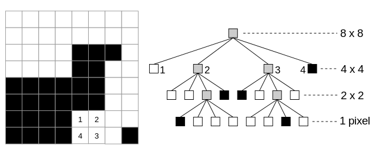

rq3
===

region-quadtree
  stupidly inefficient smoothing algorithm using quadtrees and elementary
  statistics knowledge. the idea is that you take an ``m * n`` matrix of
  darkness values, a maximum standard deviation (call this ``s``), and
  a partitioning scheme (``P``), then rinse and repeat the following steps:

- if the standard deviation of all the darkness values within an ``x * y``
  region ``<= s``, said region will be represented using the arithmetic mean
  of the values.

- else, the ``x * y`` region is partitioned using ``P``, and step 1 is
  repeated on these regions. if ``P`` is a quadtree scheme then the
  region will be split into 4 roughly ``x/2 * y/2`` regions.

- said quadtree can then be traversed and the image will be the result of
  recursively joining the nodes of the quadtree together.

todo
----

- clean up code
- different heurestics instead of just stdev
- rewrite in Go because reasons
